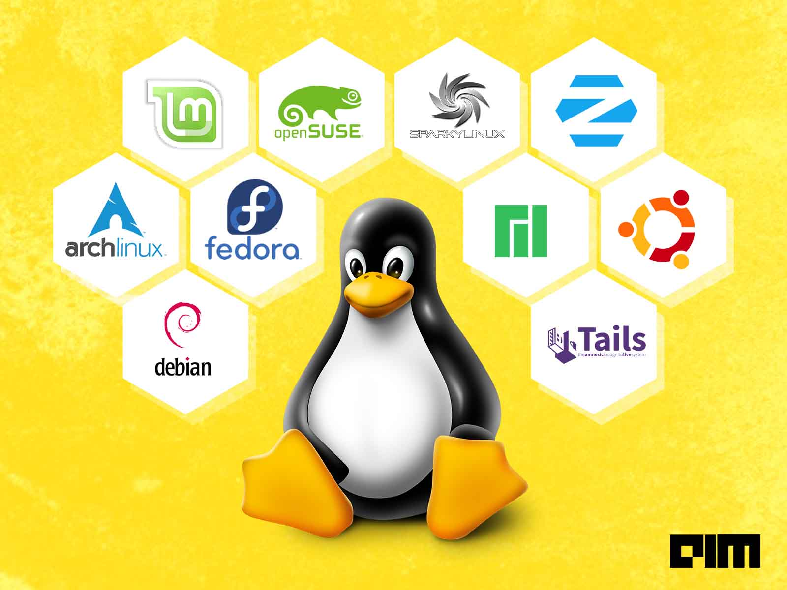
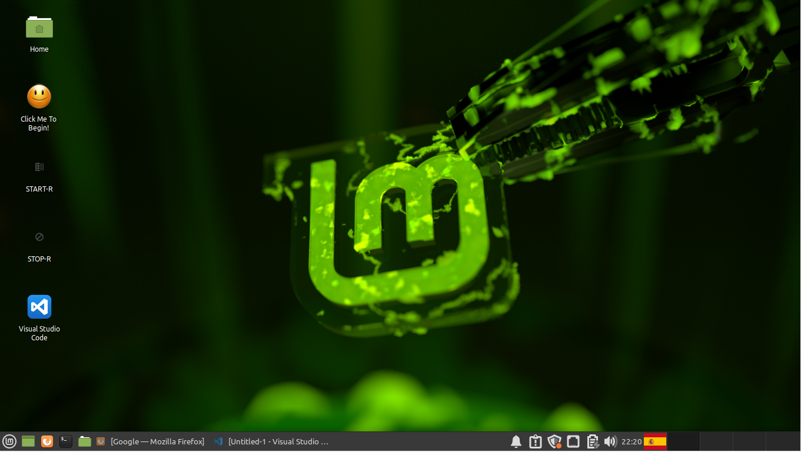

# Welcome to the Introduction to Bioinformatic for Biologist Course
Me: Joaquín Giner

Location: CBGP CsBGP Laboratory 

 

## Your Virtual Machine

### Main components
Linux Mint 20 64-bit (with Xfce interface).

 

### General Description

 

Linus Torvalds was a Helsinki university student who liked playing around with software and computers (but it seems, [he has some troubles to understand people’s emotions and respond appropriately](https://www.newyorker.com/science/elements/after-years-of-abusive-e-mails-the-creator-of-linux-steps-aside).In 1991 he announced the creation of a new core operating system that he had named Linux. 

1. Linux powers 94% of the world’s supercomputers, most of the servers powering the Internet, and a billion+ Android devices. 
1. 97% of managers reported that they will prioritize hiring employees competent in Linux relative to other skills areas. 
1. Linux is particularly suitable for businesses with small IT budgets (like scientific laboratories!!!!). 
1. Linux is free to use and install, and is extremely stable and reliable (no blue screen of death!).

 

### Linux Mint 20.0

***Unlike Windows, there are many different interfaces ("shells"), distributions, and "flavours" of Linux***. Obviously, the shell that is on your Android phone is very different from the shell you are using now (Mint 20). Note that there are also many different shells for your phone! Linux will also be embedded in devices like Raspberry PI, your WiFi router, your Smart TV, entertainment systems in your car, and spacecraft. ***Linux can be very very small - there are distributions of Linux that will run in as little as 3MB of RAM!***

### Mint 20 Xfce is a very rich desktop interface. 

1. It works like Mac/Windows - drag/drop, left/right click - menu bar (at the bottom of the screen). 
2. The main menu is the green "mint" icon at the bottom left. 
3. Applications are sorted based on their general type. 
4. Mint comes with Libre Office, which is like Microsoft Office (but free!), Firefox web browser, and a wide range of basic utilities like PDF file readers, etc. 
5. Our VM also contains Visual Studio Code (an editor for writing software) - the icon for this is on your desktop. 
6. The default keyboard layout of the VM have been set to be "Spanish". If you click the spanish flag in the bottom right, you can switch to a US-layout keyboard.

 

 

### The very beggining in Linux

One of the main applications you will need to know for the first few days is the `Terminal`. The icon to start the Terminal is in the icon bar (bottom left of your screen) - a black box icon. Open that now. You will notice that the terminal window is slightly transparent - I like it that way, but you can change this if you don't.

The "command prompt" is the "stuff" before the flashing white box. By default, Mint 20 tells you:

Your username
Your current "location" in the filesystem
The command prompt ('$')

`e.g. osboxes@osboxes ~ $`

Type: "cd Course" ("cd" = "Change directory") and press Enter. Your command prompt now changes to:

`osboxes@osboxes ~/Course $`

Autocomplete is a common feature in most Linux distributions, and is activated by pressing the 'Tab' key. Autocomplete is "smart" in that it will select either an app (in the context where you need an app) or a file-name (in the context where you need a filename). Try this:

`osboxes@osboxes ~/Course $ fire`                 (now press Tab)

`osboxes@osboxes ~/Course $ firefox`              (now press Tab again)

`osboxes@osboxes ~/Course $ firefox Accelerated_Intro_to_CompBio_Part_1/`

Remember this! It's a very cool trick that will speed-up your typing!!!

To go "up" one level of directory, type 'cd ..' (two dots)

To go back to your "home" directory, from anywhere, type 'cd ~'

`osboxes@osboxes ~/Course $ cd ~`

To repeat a previous command, press the UP ARROW until you see that command at the prompt (DOWN ARROW takes you through the command history in the other direction)

 

### Switching between the VM and your native Operating System
You will notice that you cannot click on your Windows/Mac desktop after you have clicked on the VM. This is because all Mouse commands are now being sent to the VM. To move "focus" back to your native Operating System, click CTRL+ALT. To move focus back to the VM, just click anywhere in the VM window. I DON'T KNOW HOW TO DO THIS ON A MAC. PLEASE TELL ME IF YOU KNOW.

 

### Useful Applications
The most used applications are immediately available in the menu bar.

* hide all open windows (show the desktop. DOES NOT close the apps)
* Firefox web browser
* Command Prompt
* File manager

 

### Shutting down Linux
1) The main menu has a "power" symbol that leads to a menu for logout, shut-down, or hibernate. 
2) At the command-line, "shutdown" will cause the system to close all applications and shut down

